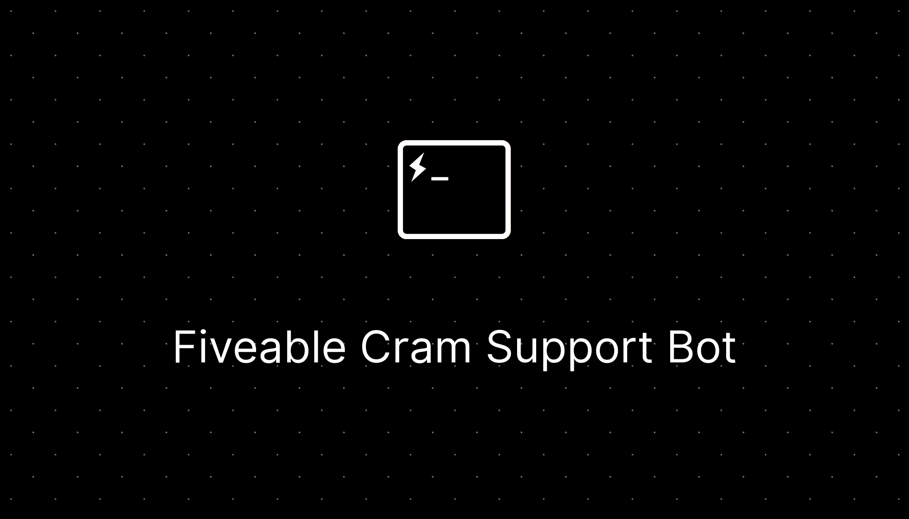
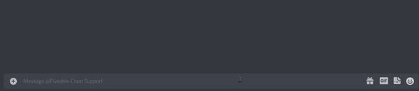
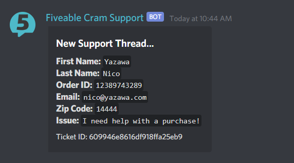

<br />
<p align="center">
  
  <p align="center">

  <div align="center">
    <a href="https://discord.gg/thinkfiveable">
      
    </a>
    <a href="https://github.com/ThinkFiveable/cram-support-bot/actions/workflows/lint.yml">
      
    </a>
  </div>

  <div align="center">
    Modmail-based support ticket bot.
    <br />
    <a href="https://github.com/thinkfiveable/cram-support-bot/issues">Report Bug</a>
    ·
    <a href="https://github.com/thinkfiveable/cram-support-bot/issues">Request Feature</a>
    ·
    <a href="https://github.com/thinkfiveable/cram-support-bot/pulls">Send a Pull Request</a>
    </p>
  </div>
</p>

# 📝 What is this?
This repository houses the code for `Fiveable Cram Support Bot` used in the [Fiveable Discord server](discord.gg/thinkfiveable). Used whenever a customer has an issue with a purchase, and needs to contact a member of the Student Success team.

# 🤔 How do I open a ticket?

You dm the bot a message, which will start the question process. If a user does not respond quick enough or provides invalid data, the ticket creation is cancelled.

<p align="center">
  
</p>

# 🤔 What does it look like from the moderators end?

<p align="center">
  
</p>

# 📝Commands

| Command              	| Description                                                                      	|
|----------------------	|----------------------------------------------------------------------------------	|
| `s!close [#channel]` 	| Close a ticket                                                                   	|
| `s!fetch <id>`       	| Fetch info and messages <br>belonging to a ticket                                	|
| `s!help [command]`   	| More info about a commmand                                                       	|
| `s!reply <content>`  	| Reply to a ticket in a ticket channel.<br>If ticket is closed, this will reopen. 	|

# 🚧 Getting Started

## ENV variables
Please supply the following ENV variables in a `.env` file in the root of the project.

| Key                  	| Description                                                       	| Optional 	|
|----------------------	|-------------------------------------------------------------------	|----------	|
| TOKEN                	| The token belonging to the Discord bot                            	|          	|
| DB_URI               	| The database URI belonging to the<br>MongoDB database             	|          	|
| PREFIX               	| Prefix for the bot                                                	|          	|
| MODMAIL_CATEGORY     	| Main category to make new support <br>threads in.                 	|          	|
| GUILD                	| The guild this bot is meant to send <br>new support threads in.   	|          	|
| MODMAIL_MAIN_CHANNEL 	| Main channel where info about tickets<br>gets dumped.             	|          	|
| ADMIN_ID             	| ID of the admin of this bot. Bypasses<br>all cooldowns/ratelimits 	|     ✔️    |

## Setup
You can deploy this project manually using the steps below, or using the include docker-compose file by doing `docker compose up -d --build`

```console
foo@bar:~$ git clone https://github.com/ThinkFiveable/cram-support-bot.git   
foo@bar:~$ cd cram-support-bot 
foo@bar:~/cram-support-bot$ npm install  
foo@bar:~/cram-support-bot$ npm run build  
// fill in env variables  
foo@bar:~/cram-support-bot$ npm run start
```

## LICENSE

This license can also be found [here](https://github.com/ThinkFiveable/cram-support-bot/blob/main/LICENSE)

```
MIT License

Copyright (c) 2021 Fiveable

Permission is hereby granted, free of charge, to any person obtaining a copy
of this software and associated documentation files (the "Software"), to deal
in the Software without restriction, including without limitation the rights
to use, copy, modify, merge, publish, distribute, sublicense, and/or sell
copies of the Software, and to permit persons to whom the Software is
furnished to do so, subject to the following conditions:

The above copyright notice and this permission notice shall be included in all
copies or substantial portions of the Software.

THE SOFTWARE IS PROVIDED "AS IS", WITHOUT WARRANTY OF ANY KIND, EXPRESS OR
IMPLIED, INCLUDING BUT NOT LIMITED TO THE WARRANTIES OF MERCHANTABILITY,
FITNESS FOR A PARTICULAR PURPOSE AND NONINFRINGEMENT. IN NO EVENT SHALL THE
AUTHORS OR COPYRIGHT HOLDERS BE LIABLE FOR ANY CLAIM, DAMAGES OR OTHER
LIABILITY, WHETHER IN AN ACTION OF CONTRACT, TORT OR OTHERWISE, ARISING FROM,
OUT OF OR IN CONNECTION WITH THE SOFTWARE OR THE USE OR OTHER DEALINGS IN THE
SOFTWARE.
```